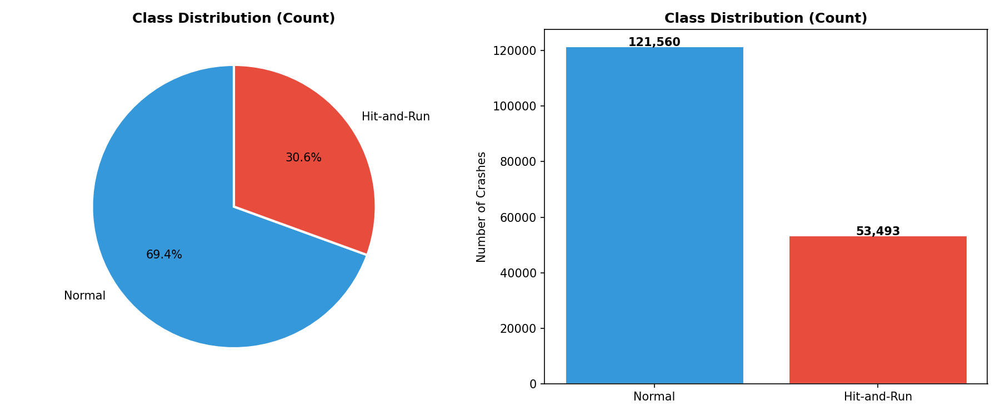
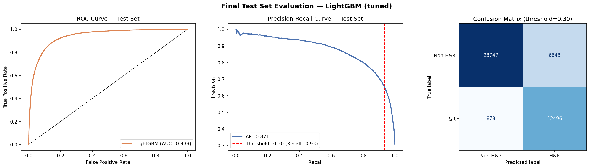
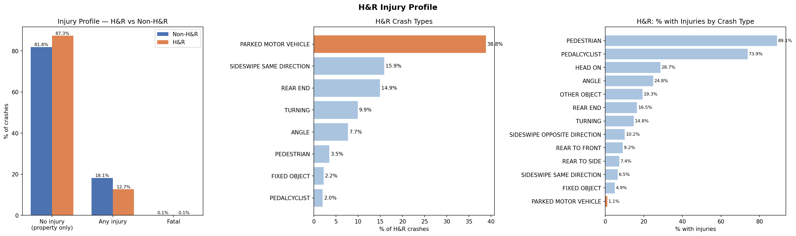
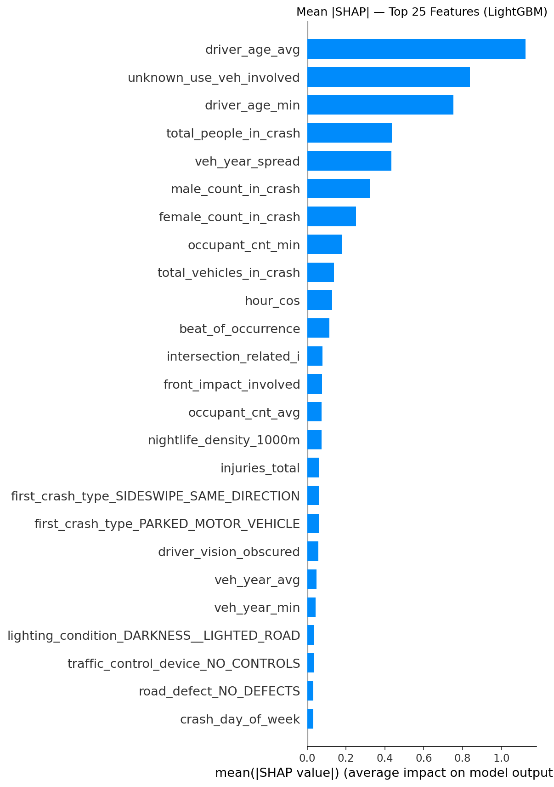
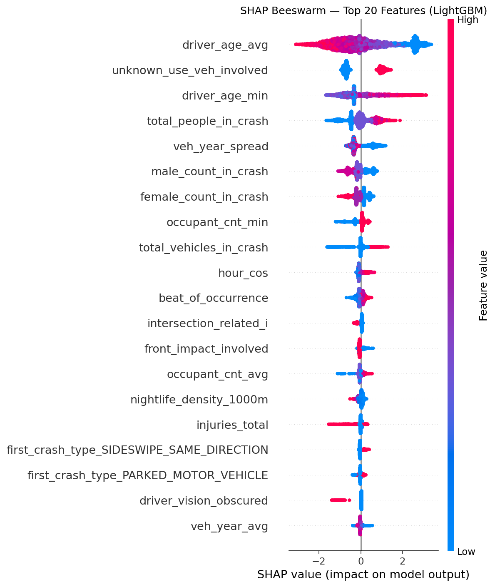
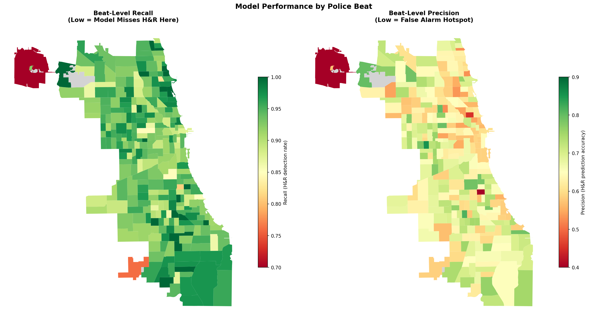
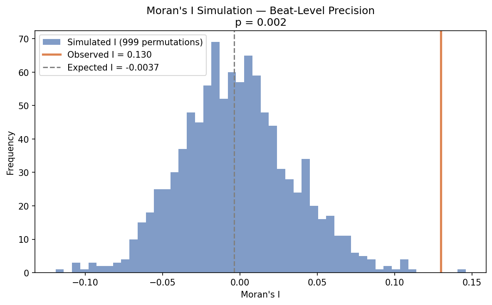

# Chicago Hit-and-Run Crash Prediction: A Multi-Dataset Analysis

---

## 1. Introduction

Hit-and-run (H&R) crashes — incidents in which at least one driver leaves the scene without exchanging information or rendering aid — represent a persistent challenge for urban traffic enforcement. Beyond accountability, H&R incidents complicate injury response and obstruct investigation. In the United States, H&R crashes account for approximately 11% of all reported crashes, with rates higher in dense urban environments (Han et al., 2025). Fatal H&R incidents have increased in recent decades, disproportionately affecting pedestrians and cyclists [CITATION 3].

Prior research has linked H&R behaviour to time of night, crash severity, roadway type, and driver demographics [CITATION 2]. Gradient boosting methods have demonstrated strong classification performance on administrative crash records, achieving AUCs of up to 0.803 (Han et al., 2025). However, existing studies rely predominantly on single-source datasets and have not examined whether proximity to nightlife establishments contributes independently to H&R risk — a factor theorised to concentrate impaired driving and late-night traffic exposure.

This study addresses that gap using a multi-dataset approach for Chicago (2024–2025), integrating crash, vehicle, person, and business licence data to model H&R classification and evaluate the role of nightlife proximity relative to behavioural, temporal, and environmental features.

---

## 2. Research Questions

**Primary:** To what extent does spatial proximity to nightlife areas and liquor-licensed establishments serve as an effective predictor for classifying hit-and-run accidents in Chicago, compared to traditional environmental, infrastructural, and multi-actor (vehicle/pedestrian) features?

**Secondary:** Do the model's prediction errors exhibit significant spatial clustering, and what can be deduced from these clusters regarding the model's geographical blind spots?

---

## 3. Data

Four datasets from the City of Chicago Open Data Portal (data.cityofchicago.org) were integrated, covering crashes from January 2024 to early 2025:

1. **Chicago Traffic Crashes** — the primary dataset (~221,000 records) containing crash-level attributes and the binary H&R indicator (`HIT_AND_RUN_I`), the target variable. Class balance is approximately 30.6% H&R (Figure 1).
2. **Vehicles** — vehicle-level records (year, occupant count, manoeuvre, defect) linked per crash.
3. **People** — person-level records (age, sex, ejection status) linked per crash.
4. **Business Licences (Nightlife)** — active liquor-licensed establishments used to compute a 1,000m nightlife density feature via spatial join.

**Preprocessing:** Post-crash leakage variables were excluded: alcohol test results, towing indicators, arrest flags, and primary contributory cause (the latter because officers write "UNABLE TO DETERMINE" precisely when the driver has fled, creating a circular dependency with the target). UNKNOWN values in officer-recorded fields were retained as informative signals — when a driver flees, officers cannot complete many fields, making informational absence a legitimate predictive feature. A binary encoding error affecting three features was identified and corrected during development, ensuring UNKNOWN responses mapped to a neutral value rather than implying condition presence.

Vehicle- and person-level records were aggregated to crash level (mean, minimum, and maximum per crash) and joined to the crash table. The dataset was split 80/20 using stratified sampling.

---

## 4. Methodology

Following Han et al. (2025), the classifier is treated as a feature importance engine rather than a deployment system. A responding officer already knows whether a crash is a hit-and-run; the model's value lies in ranking which crash characteristics most strongly associate with that outcome. Four methods were applied.

**LightGBM classifier.** A four-model comparison (Logistic Regression, Random Forest, XGBoost, LightGBM) using 5-fold stratified cross-validation selected LightGBM as the best-performing model. Two rounds of RandomizedSearchCV (25 iterations, 5-fold CV) optimised nine hyperparameters. Class imbalance was addressed via `class_weight="balanced"`, and the classification threshold was chosen by maximising the F2 score — weighting recall twice as heavily as precision to reflect the policing context where missed H&R is costlier than a false alarm. Preprocessing included target encoding for `beat_of_occurrence`, one-hot encoding for low-cardinality categoricals, and median imputation.

**SHAP (SHapley Additive exPlanations).** Global feature importance was computed via SHAP bar and beeswarm plots, quantifying each feature's marginal contribution to model output. A spatial-blind ablation — re-running cross-validation with all spatial features removed — was used to quantify nightlife proximity's incremental predictive contribution independently of feature ranking.

**Beat-level recall and precision choropleths.** Model errors were normalised by H&R crash volume per police beat — error rate rather than raw count — and mapped as choropleths across Chicago's 271 police beats. Beats with fewer than five H&R crashes in the test set were excluded.

**Moran's I.** Spatial autocorrelation of beat-level recall and precision was tested using Moran's I with Queen contiguity weights (row-standardised) and 999 random permutations, directly addressing the secondary research question.

---

## 5. Results and Discussion

### 5a. Model Performance

Cross-validated ROC-AUC ranged from 0.900 (Logistic Regression) to 0.937 (LightGBM), with Random Forest (0.914) and XGBoost (0.933) intermediate. The tuned LightGBM achieved a test ROC-AUC of 0.9388 — near-identical to the cross-validated estimate (0.9389), confirming no overfitting. At the F2-optimised threshold of 0.298, the model achieves a recall of 0.934 and precision of 0.653 (Figure 2). The high AUC reflects the richness of the complete crash report and should be interpreted within the explanatory framing rather than as operational accuracy.

### 5b. H&R Crash Profile

Understanding what H&R crashes are contextualises the model's behaviour. The majority (87.4%) involve no physical injury, and 38.8% are unwitnessed parked vehicle incidents — a driver clipping a parked car and fleeing unobserved (Figure 3). This opportunistic property damage scenario dominates the data and drives the model's primary signal. Pedestrian H&R (3.5% of cases, injury rate >80%) and cyclist H&R (2.0%, >60%) represent the cases of greatest harm but are numerically a small minority.

### 5c. Feature Importance and Primary Research Question

The crash profile shapes interpretation of the SHAP results. SHAP analysis identifies three dominant feature clusters across all features (Figures 4–5). The largest relates to **witness and victim absence**: `driver_age_avg` ranks first overall, encoding two distinct signals — crashes with no persons recorded at scene (age = 0, occurring in 40.9% of H&R cases versus 6.4% of non-H&R) and victim demographic context where persons were present. `unknown_use_veh_involved` (#2) captures unidentifiable vehicle use, strongly indicative of a vehicle that fled before documentation. `total_people_in_crash` (#4) and gender-specific counts (#6, #7) further decompose witness presence. The second cluster captures **temporal anonymity**: `hour_cos` (#10) peaks at midnight, encoding the 24-hour cycle with late-night crashes most predictive of H&R. The third reflects **crash geometry**: mid-block location (`intersection_related_i`, #12) and absence of frontal impact (`front_impact_involved`, #13) both reduce witness exposure.

Nightlife density (`nightlife_density_1000m`) ranks 15th. A spatial-blind ablation confirms this: removing all spatial features reduces ROC-AUC by only 0.0002. This negligible contribution reflects shared variance — nightlife proximity co-occurs with late-night timing, parked vehicle crashes, and low witness presence, which are already captured by crash-level features. To answer the primary research question: nightlife proximity is not an independent predictor of H&R when crash-level behavioural and temporal features are controlled for. This is a shared-variance finding; causal claims are not warranted from observational data.

### 5d. Spatial Error Analysis and Secondary Research Question

Beat-level recall is high and broadly uniform across Chicago, with most beats scoring 0.90–1.00 (Figure 6). A visual low-recall cluster appears in the northwest. However, Moran's I on beat-level recall yields I = 0.039 (p = 0.106), indicating no statistically significant spatial autocorrelation. The model's missed H&R crashes are spatially random — no systematic geographic blind spots exist in detection.

Beat-level precision tells a different story. Moran's I on precision yields I = 0.130 (p = 0.001, z = 3.67), indicating significant positive spatial autocorrelation (Figure 7). False alarm rates cluster geographically, concentrated along the north lakefront and central corridors — dense environments where crash characteristics systematically resemble H&R conditions without the driver actually fleeing. To answer the secondary research question: prediction errors cluster spatially, but asymmetrically — missed detections are spatially random, while false alarms concentrate in environments that structurally mimic H&R conditions.

---

## 6. Conclusion

This study demonstrates that nightlife proximity contributes negligible independent predictive value for H&R classification once crash-level behavioural and temporal features are controlled for. The dominant predictors are witness absence, unidentifiable vehicle information, late-night timing, and crash geometry — reflecting the opportunity for undetected flight rather than proximity to alcohol-serving venues. Spatially, the model exhibits no systematic detection blind spots (Moran's I recall: p = 0.106), but false alarms cluster significantly in dense urban corridors (Moran's I precision: I = 0.130, p = 0.001). Limitations include the observational design precluding causal inference, and the dominance of property-damage-only H&R (87.4% no injury), which tunes the model primarily to the parked-vehicle scenario and may limit sensitivity to the more consequential pedestrian and cyclist subset. Future work should develop targeted models for injury-involved H&R and apply causal methods to evaluate the nightlife environment's role.

---

## 7. References

Han, X., Huang, H., & Zhu, X. (2025). Investigating the contributors to hit-and-run crashes using gradient boosting decision trees. *PLOS ONE*, 20(1), e0314939. https://doi.org/10.1371/journal.pone.0314939

[CITATION 2 — verify on Google Scholar before submitting. Candidate: Benson, A.J., Tefft, B.C., Arnold, L.S., & Horrey, W.J. (2021). Fatal hit-and-run crashes: Factors associated with leaving the scene. *Journal of Safety Research*, 79, 76–82. https://doi.org/10.1016/j.jsr.2021.08.007]

[CITATION 3 — verify on Google Scholar before submitting. Search: "hit-and-run pedestrian cyclist injury severity" in Accident Analysis & Prevention 2019–2024]
